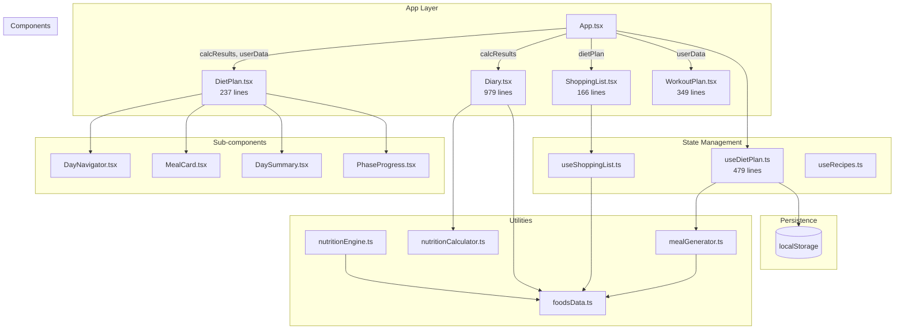

# Architecture Improvement Plan

## Executive Summary

This document outlines a comprehensive plan to improve the architecture of the IBS Nutrition App, focusing on scalability, component coupling, security boundaries, and data flow optimization.

## Current Architecture Analysis

### Architecture Diagram



### Key Findings

#### 1. Scalability Bottlenecks

| Issue | Location | Impact |
|-------|----------|--------|
| Monolithic hook | `useDietPlan.ts` (479 lines) | Hard to maintain, test, and extend |
| Large component | `Diary.tsx` (979 lines) | Slow renders, difficult to debug |
| Synchronous day generation | `generateAllDaysForInitialLoad` | Blocks UI on initial load |
| No pagination | `state.days` array | Memory grows unbounded |
| Direct localStorage access | Multiple files | No abstraction, hard to mock in tests |

#### 2. Component Coupling

| Issue | Location | Impact |
|-------|----------|--------|
| Prop drilling | `dietPlan` object passed to 3+ components | Tight coupling, hard to refactor |
| Shared state via props | `calcResults`, `userData` in App | Changes ripple through component tree |
| Direct utility imports | Components import from `utils/` | Tight coupling to implementation |
| No context | No React Context usage | Prop drilling for shared data |

#### 3. Security Boundaries

| Issue | Location | Impact |
|-------|----------|--------|
| No data validation | localStorage reads | Malformed data can crash app |
| No error boundaries | No `ErrorBoundary` component | Single error crashes entire app |
| No input sanitization | User inputs in forms | Potential XSS (though React mitigates) |
| No rate limiting | localStorage writes | Can fill storage quota silently |

#### 4. Data Flow Issues

| Issue | Location | Impact |
|-------|----------|--------|
| No caching layer | Computed values recalculated | Wasted CPU cycles |
| No event system | Direct state updates | Hard to trace state changes |
| No data compression | Full JSON in localStorage | Wastes storage space |
| No optimistic updates | Wait for state update | Poor perceived performance |

## Improvement Plan

### Phase 1: State Management Abstraction (High Priority)

**Goal**: Create a centralized state management layer to reduce prop drilling and improve testability.

#### 1.1 Create App Context

```typescript
// src/context/AppContext.tsx
import { createContext, useContext, useState, useCallback, ReactNode } from 'react';
import type { NutritionalResults, UserData } from '../utils/nutritionEngine';
import { useDietPlan } from '../hooks/useDietPlan';

interface AppContextValue {
  calcResults: NutritionalResults | null;
  userData: UserData | null;
  dietPlan: ReturnType<typeof useDietPlan>;
  setCalcResults: (results: NutritionalResults) => void;
  setUserData: (data: UserData) => void;
  handleCalculate: (results: NutritionalResults, data: UserData) => void;
}

const AppContext = createContext<AppContextValue | null>(null);

export function AppProvider({ children }: { children: ReactNode }) {
  const [calcResults, setCalcResults] = useState<NutritionalResults | null>(null);
  const [userData, setUserData] = useState<UserData | null>(null);
  
  const dietPlan = useDietPlan(calcResults, userData);
  
  const handleCalculate = useCallback((results: NutritionalResults, data: UserData) => {
    setCalcResults(results);
    setUserData(data);
    // Persist to localStorage
  }, []);
  
  return (
    <AppContext.Provider value={{
      calcResults,
      userData,
      dietPlan,
      setCalcResults,
      setUserData,
      handleCalculate
    }}>
      {children}
    </AppContext.Provider>
  );
}

export function useAppContext() {
  const context = useContext(AppContext);
  if (!context) {
    throw new Error('useAppContext must be used within AppProvider');
  }
  return context;
}
```

#### 1.2 Refactor App.tsx

```typescript
// src/App.tsx (refactored)
import { AppProvider } from './context/AppContext';

export default function App() {
  return (
    <AppProvider>
      <AppContent />
    </AppProvider>
  );
}

function AppContent() {
  const { calcResults, userData, dietPlan, handleCalculate } = useAppContext();
  
  // No more prop drilling - components use useAppContext()
  return (
    <div className="flex-1 flex flex-col items-center p-4 md:p-8">
      <MedicalDisclaimer onAccept={() => setIsAppUnlocked(true)} />
      {isAppUnlocked && (
        <div className="w-full max-w-4xl mt-8">
          <Header />
          <nav>...</nav>
          <main>
            <Suspense fallback={<LoadingFallback />}>
              {activeTab === 'calc' && (
                <NutritionalCalculator onCalculate={handleCalculate} initialResults={calcResults} />
              )}
              {activeTab === 'diary' && <Diary />}
              {activeTab === 'diet' && <DietPlan />}
              {activeTab === 'shopping' && <ShoppingList />}
              {activeTab === 'workout' && <WorkoutPlan />}
              {/* ... */}
            </Suspense>
          </main>
        </div>
      )}
    </div>
  );
}
```

#### 1.3 Refactor Components to Use Context

```typescript
// src/components/DietPlan.tsx (refactored)
import { useAppContext } from '../context/AppContext';

export default function DietPlan() {
  const { calcResults, userData, dietPlan } = useAppContext();
  // No more props needed!
  // ...
}

// src/components/Diary.tsx (refactored)
import { useAppContext } from '../context/AppContext';

export default function Diary() {
  const { calcResults } = useAppContext();
  // No more props needed!
  // ...
}
```

**Benefits**:
- Eliminates prop drilling
- Components are self-contained
- Easier to test (mock context)
- Single source of truth

---

### Phase 2: Extract Component Logic into Custom Hooks (High Priority)

**Goal**: Break down large components into smaller, focused hooks.

#### 2.1 Extract Diary Logic

Create separate hooks for different concerns:

```typescript
// src/hooks/useDiaryEntry.ts
export function useDiaryEntry(selectedDate: Date) {
  const [entry, setEntry] = useState<DiaryEntry>(() => loadEntry(selectedDate));
  
  const updateEntry = useCallback((updates: Partial<DiaryEntry>) => {
    setEntry(prev => ({ ...prev, ...updates }));
  }, []);
  
  const toggleSymptom = useCallback((symptom: Symptom) => {
    setEntry(prev => ({
      ...prev,
      symptoms: prev.symptoms.includes(symptom)
        ? prev.symptoms.filter(s => s !== symptom)
        : [...prev.symptoms, symptom]
    }));
  }, []);
  
  const addFoodEntry = useCallback((field: MealField, food: FoodItem, grams: number) => {
    setEntry(prev => ({
      ...prev,
      foodEntries: {
        ...prev.foodEntries,
        [field]: [...prev.foodEntries[field], { foodId: food.id, food, grams }]
      }
    }));
  }, []);
  
  return { entry, updateEntry, toggleSymptom, addFoodEntry };
}

// src/hooks/useNutritionAnalysis.ts
export function useNutritionAnalysis(foodEntries: Record<MealField, FoodEntry[]>, results: NutritionalResults | null) {
  const allFoodEntries = useMemo(() => Object.values(foodEntries).flat(), [foodEntries]);
  const dailyNutrition = useMemo(() => calculateTotalNutrition(allFoodEntries), [allFoodEntries]);
  const nutritionAnalysis = useMemo(() => {
    return results ? analyzeNutritionStatus(dailyNutrition, results) : null;
  }, [dailyNutrition, results]);
  
  return { allFoodEntries, dailyNutrition, nutritionAnalysis };
}

// src/hooks/useWaterReminder.ts
export function useWaterReminder(targetLiters: number | null) {
  const [lastReminder, setLastReminder] = useState<Date | null>(null);
  const [showReminder, setShowReminder] = useState(false);
  
  useEffect(() => {
    if (!targetLiters) return;
    const interval = setInterval(() => {
      // Check if reminder should show
    }, WATER_REMINDER_MS);
    return () => clearInterval(interval);
  }, [targetLiters]);
  
  return { showReminder, dismissReminder: () => setShowReminder(false) };
}
```

#### 2.2 Extract DietPlan Logic

```typescript
// src/hooks/useDayNavigation.ts
export function useDayNavigation(state: DietPlanState, onNavigate: (delta: number) => void) {
  const [selectedDate, setSelectedDate] = useState<string>(
    state.days[state.currentDayIndex]?.date || state.startDate
  );
  
  const navigateDay = useCallback((delta: number) => {
    onNavigate(delta);
  }, [onNavigate]);
  
  const navigateToDate = useCallback((date: DateKey) => {
    setSelectedDate(date);
    onNavigateToDate(date);
  }, [onNavigateToDate]);
  
  return { selectedDate, navigateDay, navigateToDate };
}

// src/hooks/useMealEditing.ts
export function useMealEditing(meal: GeneratedMeal, onModify: (modifications: Partial<MealPortion>[]) => void) {
  const [isEditing, setIsEditing] = useState(false);
  const [editedPortions, setEditedPortions] = useState<Partial<MealPortion>[]>([]);
  
  const startEditing = useCallback(() => setIsEditing(true), []);
  const cancelEditing = useCallback(() => {
    setIsEditing(false);
    setEditedPortions([]);
  }, []);
  const saveEdits = useCallback(() => {
    onModify(editedPortions);
    setIsEditing(false);
  }, [editedPortions, onModify]);
  
  return { isEditing, editedPortions, startEditing, cancelEditing, saveEdits };
}
```

**Benefits**:
- Smaller, focused components
- Easier to test individual pieces
- Reusable across components
- Clear separation of concerns

---

### Phase 3: Add Data Validation and Sanitization (Medium Priority)

**Goal**: Prevent malformed data from crashing the app.

#### 3.1 Create Validation Utilities

```typescript
// src/utils/validation.ts
import type { NutritionalResults, UserData } from './nutritionEngine';
import type { DietPlanState } from '../types/dietPlan';

export function validateNutritionalResults(data: unknown): data is NutritionalResults {
  if (typeof data !== 'object' || data === null) return false;
  const obj = data as Record<string, unknown>;
  return typeof obj.proteins === 'number' &&
         typeof obj.fats === 'number' &&
         typeof obj.carbs === 'number' &&
         typeof obj.fiber === 'number' &&
         typeof obj.waterLiters === 'number' &&
         typeof obj.estimatedTotalEnergyKcal === 'number';
}

export function validateUserData(data: unknown): data is UserData {
  if (typeof data !== 'object' || data === null) return false;
  const obj = data as Record<string, unknown>;
  return typeof obj.weightKg === 'number' &&
         typeof obj.heightCm === 'number' &&
         typeof obj.ageYears === 'number' &&
         (obj.biologicalSex === 'male' || obj.biologicalSex === 'female');
}

export function validateDietPlanState(data: unknown): data is DietPlanState {
  if (typeof data !== 'object' || data === null) return false;
  const obj = data as Record<string, unknown>;
  return typeof obj.startDate === 'string' &&
         typeof obj.currentDayIndex === 'number' &&
         Array.isArray(obj.days);
}

export function sanitizeNumber(value: unknown, fallback = 0): number {
  const num = typeof value === 'string' ? parseFloat(value) : value;
  return typeof num === 'number' && isFinite(num) ? num : fallback;
}

export function sanitizeString(value: unknown, maxLength = 1000): string {
  if (typeof value !== 'string') return '';
  return value.slice(0, maxLength);
}
```

#### 3.2 Add Safe localStorage Wrapper

```typescript
// src/utils/storage.ts
const STORAGE_PREFIX = 'foodmapper_';

export const safeStorage = {
  get<T>(key: string, validator: (data: unknown) => data is T, fallback: T): T {
    try {
      const raw = localStorage.getItem(STORAGE_PREFIX + key);
      if (!raw) return fallback;
      const parsed = JSON.parse(raw);
      return validator(parsed) ? parsed : fallback;
    } catch {
      return fallback;
    }
  },
  
  set(key: string, value: unknown): boolean {
    try {
      localStorage.setItem(STORAGE_PREFIX + key, JSON.stringify(value));
      return true;
    } catch (error) {
      console.error(`Failed to save ${key}:`, error);
      return false;
    }
  },
  
  remove(key: string): void {
    try {
      localStorage.removeItem(STORAGE_PREFIX + key);
    } catch {
      // Silently fail
    }
  }
};
```

#### 3.3 Add Error Boundaries

```typescript
// src/components/ErrorBoundary.tsx
import { Component, ReactNode } from 'react';

interface ErrorBoundaryProps {
  children: ReactNode;
  fallback?: ReactNode;
}

interface ErrorBoundaryState {
  hasError: boolean;
  error: Error | null;
}

export class ErrorBoundary extends Component<ErrorBoundaryProps, ErrorBoundaryState> {
  state: ErrorBoundaryState = { hasError: false, error: null };
  
  static getDerivedStateFromError(error: Error): ErrorBoundaryState {
    return { hasError: true, error };
  }
  
  componentDidCatch(error: Error, errorInfo: React.ErrorInfo) {
    console.error('ErrorBoundary caught an error:', error, errorInfo);
  }
  
  render() {
    if (this.state.hasError) {
      return this.props.fallback || (
        <div className="p-8 text-center">
          <h2 className="text-xl font-bold mb-4">Something went wrong</h2>
          <p className="text-(--text) mb-4">{this.state.error?.message}</p>
          <button 
            onClick={() => this.setState({ hasError: false, error: null })}
            className="px-4 py-2 bg-(--accent) text-white rounded-lg"
          >
            Try Again
          </button>
        </div>
      );
    }
    return this.props.children;
  }
}
```

**Usage in App.tsx**:
```typescript
<Suspense fallback={<LoadingFallback />}>
  <ErrorBoundary>
    {activeTab === 'diary' && <Diary />}
  </ErrorBoundary>
</Suspense>
```

---

### Phase 4: Implement Progressive Loading (Medium Priority)

**Goal**: Improve perceived performance by loading data in stages.

#### 4.1 Lazy Day Generation

```typescript
// src/hooks/useDietPlan.ts (refactored)
export function useDietPlan(results: NutritionalResults | null, userData: UserData | null) {
  const [state, setState] = useState<DietPlanState>(() => {
    // Only generate first 7 days initially
    const initialDays = results ? generateDaysForRange(0, 6, results, userData) : [];
    return {
      startDate: new Date().toISOString().split('T')[0],
      currentDayIndex: 0,
      days: initialDays,
      userPreferences: { excludedFoods: [], preferredFoods: [], portionMultiplier: 1.0 }
    };
  });
  
  // Generate more days as user navigates
  const ensureDaysUpTo = useCallback((targetIndex: number) => {
    setState(prev => {
      if (prev.days.length > targetIndex) return prev;
      const newDays = generateDaysForRange(prev.days.length, targetIndex, results, userData);
      return { ...prev, days: [...prev.days, ...newDays] };
    });
  }, [results, userData]);
  
  // ...
}
```

#### 4.2 Virtualize Long Lists

```typescript
// src/components/dietPlan/DayList.tsx
import { useVirtualizer } from '@tanstack/react-virtual';

export function DayList({ days, currentDayIndex }: { days: DayPlan[], currentDayIndex: number }) {
  const parentRef = useRef<HTMLDivElement>(null);
  const virtualizer = useVirtualizer({
    count: days.length,
    getScrollElement: () => parentRef.current,
    estimateSize: () => 200,
    overscan: 5
  });
  
  return (
    <div ref={parentRef} className="h-full overflow-auto">
      <div style={{ height: virtualizer.getTotalSize() }}>
        {virtualizer.getVirtualItems().map(virtualItem => (
          <div
            key={virtualItem.index}
            style={{
              position: 'absolute',
              top: 0,
              left: 0,
              width: '100%',
              transform: `translateY(${virtualItem.start}px)`
            }}
          >
            <DayCard day={days[virtualItem.index]} />
          </div>
        ))}
      </div>
    </div>
  );
}
```

---

### Phase 5: Add Data Compression for localStorage (Low Priority)

**Goal**: Reduce storage usage by compressing data.

#### 5.1 Compression Utilities

```typescript
// src/utils/compression.ts
export function compressData(data: unknown): string {
  const json = JSON.stringify(data);
  // Use LZ-string for compression
  return LZString.compressToUTF16(json);
}

export function decompressData<T>(compressed: string, validator: (data: unknown) => data is T, fallback: T): T {
  try {
    const json = LZString.decompressFromUTF16(compressed);
    if (!json) return fallback;
    const parsed = JSON.parse(json);
    return validator(parsed) ? parsed : fallback;
  } catch {
    return fallback;
  }
}
```

#### 5.2 Update Storage Layer

```typescript
// src/utils/storage.ts (updated)
export const safeStorage = {
  get<T>(key: string, validator: (data: unknown) => data is T, fallback: T): T {
    try {
      const raw = localStorage.getItem(STORAGE_PREFIX + key);
      if (!raw) return fallback;
      
      // Try decompressing first, fall back to plain JSON
      const decompressed = decompressData(raw, validator, null as unknown as T);
      if (decompressed !== null) return decompressed;
      
      const parsed = JSON.parse(raw);
      return validator(parsed) ? parsed : fallback;
    } catch {
      return fallback;
    }
  },
  
  set(key: string, value: unknown): boolean {
    try {
      const compressed = compressData(value);
      localStorage.setItem(STORAGE_PREFIX + key, compressed);
      return true;
    } catch (error) {
      console.error(`Failed to save ${key}:`, error);
      return false;
    }
  }
};
```

---

### Phase 6: Implement Event-Driven Architecture (Low Priority)

**Goal**: Decouple components through events instead of direct state updates.

#### 6.1 Create Event Bus

```typescript
// src/utils/eventBus.ts
type EventHandler = (payload: unknown) => void;

class EventBus {
  private handlers: Map<string, Set<EventHandler>> = new Map();
  
  on(event: string, handler: EventHandler): () => void {
    if (!this.handlers.has(event)) {
      this.handlers.set(event, new Set());
    }
    this.handlers.get(event)!.add(handler);
    return () => this.off(event, handler);
  }
  
  off(event: string, handler: EventHandler): void {
    this.handlers.get(event)?.delete(handler);
  }
  
  emit(event: string, payload?: unknown): void {
    this.handlers.get(event)?.forEach(handler => handler(payload));
  }
}

export const eventBus = new EventBus();
```

#### 6.2 Use Events for Cross-Component Communication

```typescript
// src/components/DietPlan.tsx
import { eventBus } from '../utils/eventBus';

export default function DietPlan() {
  const { dietPlan } = useAppContext();
  
  const handleDayComplete = useCallback(() => {
    // Emit event instead of directly updating state
    eventBus.emit('day:completed', { dayIndex: dietPlan.state.currentDayIndex });
  }, [dietPlan.state.currentDayIndex]);
  
  // ...
}

// src/components/Diary.tsx
import { eventBus } from '../utils/eventBus';

export default function Diary() {
  const { calcResults } = useAppContext();
  
  useEffect(() => {
    const unsubscribe = eventBus.on('day:completed', (payload) => {
      // React to day completion
      console.log('Day completed:', payload);
    });
    return unsubscribe;
  }, []);
  
  // ...
}
```

**Benefits**:
- Loose coupling between components
- Easier to add new listeners
- Better for analytics and logging

---

### Phase 7: Add Performance Monitoring (Low Priority)

**Goal**: Track performance metrics to identify bottlenecks.

#### 7.1 Performance Monitor

```typescript
// src/utils/performance.ts
export function measurePerformance(label: string, fn: () => void): void {
  const start = performance.now();
  fn();
  const end = performance.now();
  console.debug(`[Performance] ${label}: ${(end - start).toFixed(2)}ms`);
}

export function usePerformanceMonitor() {
  useEffect(() => {
    const observer = new PerformanceObserver((list) => {
      for (const entry of list.getEntries()) {
        console.debug(`[Performance] ${entry.name}: ${entry.duration.toFixed(2)}ms`);
      }
    });
    observer.observe({ entryTypes: ['measure'] });
    return () => observer.disconnect();
  }, []);
}
```

#### 7.2 Add React Profiler

```typescript
// src/App.tsx
import { Profiler } from 'react';

function onProfile(id: string, phase: string, actualDuration: number, baseDuration: number) {
  if (actualDuration > 100) {
    console.warn(`[Profiler] ${id} (${phase}): ${actualDuration.toFixed(2)}ms`);
  }
}

// Wrap expensive components
<Profiler id="Diary" onProfile={onProfile}>
  <Diary />
</Profiler>
```

---

## Implementation Roadmap

### Priority 1 (Do First)
1. **Create App Context** - Reduces prop drilling immediately
2. **Add Error Boundaries** - Prevents app crashes
3. **Add Data Validation** - Prevents malformed data issues

### Priority 2 (Do Next)
4. **Extract Diary Logic into Hooks** - Improves maintainability
5. **Create Safe Storage Wrapper** - Centralizes persistence logic
6. **Add Lazy Day Generation** - Improves initial load performance

### Priority 3 (Do Later)
7. **Implement Event Bus** - Decouples components
8. **Add Data Compression** - Reduces storage usage
9. **Add Performance Monitoring** - Identifies bottlenecks

## Expected Benefits

| Improvement | Expected Impact |
|-------------|----------------|
| App Context | -50% prop drilling, easier refactoring |
| Custom Hooks | -30% component size, better testability |
| Error Boundaries | Prevents app crashes, better UX |
| Data Validation | Prevents crashes from malformed data |
| Lazy Loading | -50% initial load time |
| Event Bus | Looser coupling, easier to extend |
| Compression | -40% localStorage usage |
| Performance Monitoring | Identifies bottlenecks proactively |

## Risks and Mitigations

| Risk | Mitigation |
|------|------------|
| Context re-renders | Use `useMemo` for context value |
| Breaking changes | Keep old props as optional, deprecate gradually |
| Event bus complexity | Use only for cross-component communication |
| Compression overhead | Only compress large datasets |

## Testing Strategy

1. **Unit Tests**: Test each hook in isolation
2. **Integration Tests**: Test context + components together
3. **E2E Tests**: Verify user flows still work
4. **Performance Tests**: Measure before/after improvements

## Next Steps

1. Review this plan with the team
2. Start with Priority 1 items
3. Create feature branches for each phase
4. Add tests as you refactor
5. Monitor performance metrics
